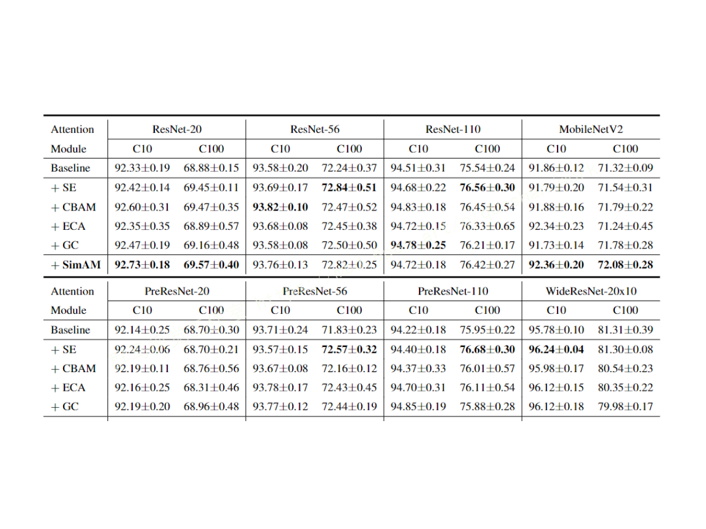

# 1.研究背景
随着我国加入WTO，银行与国际金融的接轨，外汇存兑尤其是美元柜台交易业务已成为各银行必须的业务。然而美元鉴伪机具很少，可以信赖的美元鉴伪机具更是微乎其微。再加上造假者猖獗，这从一个侧面折射出目前所应用的技术尚待进一步完善，另一方面也反映出美元鉴伪研究课题具有理论与实际双重挑战性。 本文在充分学习了美元识别的国内外研究现状和研究方法之后，分析了美元真伪币的特征，选用有效的传感器获取美元有用的隐性特征，并针对美元的特征提取和识别进行了一些的探讨，提出了一种基于改进YOLOv7的美元识别方法。

# 2.图片演示


# 3.视频演示
[基于改进YOLOv7的美元识别系统（源码＆教程）_哔哩哔哩_bilibili](https://www.bilibili.com/video/BV1se411j77q/?vd_source=bc9aec86d164b67a7004b996143742dc)


# 4.数据集


# 5.YOLOv7的改进
作为当前先进的深度学习目标检测算法YOLOv7，按照[该博客的方案](https://mbd.pub/o/bread/Y5mUk5tq)已经集合了大量的trick，但是还是有提高和改进的空间，针对具体应用场景下的检测难点，可以不同的改进方法。此后的系列文章，将重点对YOLOv7的如何改进进行详细的介绍，目的是为了给那些搞科研的同学需要创新点或者搞工程项目的朋友需要达到更好的效果提供自己的微薄帮助和参考。由于出到YOLOv7，YOLOv5算法2020年至今已经涌现出大量改进论文，这个不论对于搞科研的同学或者已经工作的朋友来说，研究的价值和新颖度都不太够了，为与时俱进，以后改进算法以YOLOv7为基础，此前YOLOv5改进方法在YOLOv7同样适用。

# 6.引入SimAM无参数注意力
与[现有的通道关注模块和空间关注模块](https://afdian.net/item?plan_id=5b3067605a5e11ed9d8f52540025c377)相比，我们的模块无需向原始网络添加参数，而是在一层中推断特征图的3-D关注权重。具体来说，我们基于一些著名的神经科学理论，提出优化一个能量函数来发现每个神经元的重要性。我们进一步推导出能量函数的快速封闭形式的解，并表明该解可以在不到十行代码中实现。该模块的另一个优点是，大多数算子是根据定义的能量函数的解来选择的，避免了在结构调整上花费太多精力。通过对各种视觉任务的定量评估，证明了该模块的灵活性和有效性，提高了许多ConvNets的表达能力。

# 7.核心模块代码实现
```
import torch
import torch.nn as nn
 
 
class simam_module(torch.nn.Module):
    def __init__(self, channels = None, e_lambda = 1e-4):
        super(simam_module, self).__init__()
 
        self.activaton = nn.Sigmoid()
        self.e_lambda = e_lambda
 
    def __repr__(self):
        s = self.__class__.__name__ + '('
        s += ('lambda=%f)' % self.e_lambda)
        return s
 
    def forward(self, x):
 
        b, c, h, w = x.size()
        
        n = w * h - 1
 
        x_minus_mu_square = (x - x.mean(dim=[2,3], keepdim=True)).pow(2)
        y = x_minus_mu_square / (4 * (x_minus_mu_square.sum(dim=[2,3], keepdim=True) / n + self.e_lambda)) + 0.5
 
        return x * self.activaton(y)
```
# 8.实验结果


# 9.系统整合
[下图源码＆环境部署视频教程＆数据集＆自定义UI界面＆改进的网络结构](https://s.xiaocichang.com/s/60df17)

参考[博客《基于改进YOLOv7的美元识别系统（源码＆教程）》](https://mbd.pub/o/qunma/work)
# 10.参考文献
[1]赵堃,华宇宁.基于小波变换及加权主元分析的人脸表情识别[D].2008
[2]蒋琳琼,贺建飚.基于支持向量机的货币识别应用研究[D].2007
[3]徐春明,姜海波,于建江.一种新的加权主分量分析方法[D].2007
[4]李清勇,胡宏,施智平,等.基于纹理语义特征的图像检索研究[D].2006
[5]周雅倩,黄萱菁,吴立德.一种特征匹配方法：稀疏特征树[D].2006
[6]宋枫溪,杨静宇,刘树海,等.基于多类最大散度差的人脸表示方法[D].2006
[7]徐科,李文峰,杨朝霖.基于幅值谱与不变矩的特征提取方法及应用[D].2006
[8]谢衍涛,桑农,张天序.基于自适应隶属度函数的特征选择[D].2006
[9]曹存根,眭跃飞,孙瑜,等.国家知识基础设施中的数学知识表示[D].2006
[10]高全学,潘泉,梁彦,等.基于描述特征的人脸识别研究[D].2006


---
#### 如果您需要更详细的【源码和环境部署教程】，除了通过【系统整合】小节的链接获取之外，还可以通过邮箱以下途径获取:
#### 1.请先在GitHub上为该项目点赞（Star），编辑一封邮件，附上点赞的截图、项目的中文描述概述（About）以及您的用途需求，发送到我们的邮箱
#### sharecode@yeah.net
#### 2.我们收到邮件后会定期根据邮件的接收顺序将【完整源码和环境部署教程】发送到您的邮箱。
#### 【免责声明】本文来源于用户投稿，如果侵犯任何第三方的合法权益，可通过邮箱联系删除。